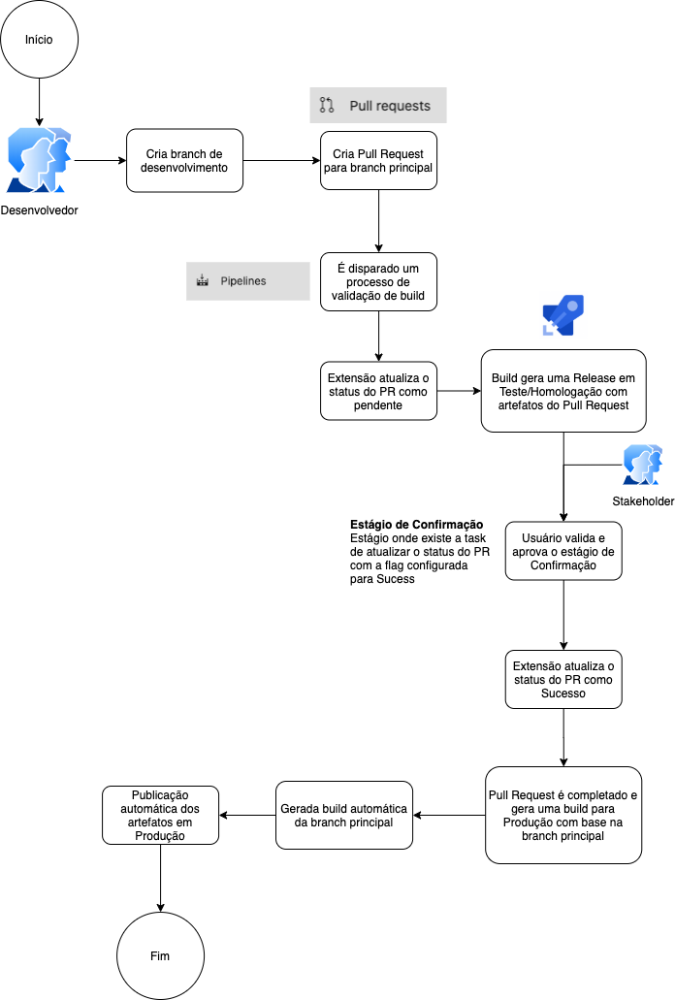

## Introdução

Uma simples extensão para adicionar aprovações de forma programática ao Pull Request.

Ao executar em uma pipeline de build/release, é possível adicionar um Status de Sucesso ou Erro/Pendência/Falha, representando estados de aprovação de um fluxo DevOps.


### Exemplo de Fluxo




### Realizando a build


```
npm i -g tfx-cli
cd pullrequeststatusmodifier
npm install
tsc
cd ..
tfx extension create --manifest-globs vss-extension.json

```


### TODO:

- Criar documentação de como utilizar
  - ~~Fluxo de Desenvolvimento em diagrama~~
  - Explicação sobre cada opção da Task
  - Motivo de criação da extensão e seus casos de uso
- Explicitar permissões necessárias
  - Visualizar problemas comuns reportados pela comunidade nos links:
    - https://github.com/MicrosoftDocs/azure-devops-docs/issues/5159
    - https://github.com/microsoft/azure-devops-node-api/issues/300
    - https://github.com/shayki5/azure-devops-create-pr-task/issues/35
    - https://developercommunity.visualstudio.com/content/problem/971099/vs402904-access-denied-user-does-not-have-edit-rel.html
- Criar Testes
  - Testes de fluxo de funcionamento
  